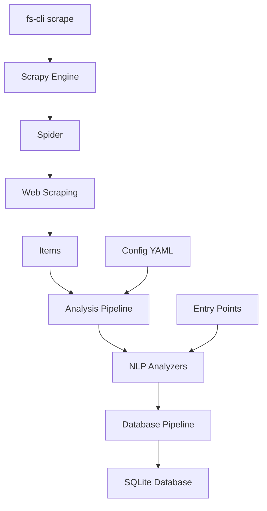

# 🕷️ Forums Scraper

**Zaawansowany scraper forów religijnych z równoległymi analizami NLP i bazami danych SQLite**

[](https://www.python.org/downloads/)
[](https://scrapy.org/)
[](https://spacy.io/)
[](https://rich.readthedocs.io/)

## 🎯 Opis projektu

Forums Scraper to profesjonalne narzędzie do scrapowania forów religijnych z zaawansowanymi funkcjami analizy tekstu. System został zaprojektowany z myślą o badaniach lingwistycznych, analizie sentymentu i modelowaniu tematów w kontekście dyskusji religijnych.

### 🎯 Główne cele

- **Badania naukowe**: Analiza dyskursu religijnego w internecie
- **Analiza sentymentu**: Badanie nastrojów w społecznościach religijnych
- **Modelowanie tematów**: Identyfikacja głównych tematów dyskusji
- **Archiwizacja**: Długoterminowe przechowywanie treści forów

## ✨ Kluczowe funkcjonalności

### 🔄 **Równoległe analizy NLP**

- **Tokenizacja podstawowa** - szybka analiza bez zależności zewnętrznych
- **Liczenie tokenów OpenAI** - estymacja kosztów API dla modeli językowych
- **Pełna analiza spaCy** - lematyzacja, POS tagging, dependency parsing
- **Analiza sentymentu** - wykrywanie emocji w tekście
- **Statystyki językowe** - czytelność, długość zdań, bogactwo słownictwa

### 🗄️ **Zaawansowana baza danych**

- **Osobne bazy SQLite** dla każdego forum
- **Pełny schemat relacyjny** - fora, sekcje, wątki, użytkownicy, posty
- **Tabele analiz** - tokeny, statystyki językowe, analiza morfosyntaktyczna
- **Indeksy wydajnościowe** - szybkie zapytania analityczne
- **Automatyczne backupy** - bezpieczne przechowywanie danych

### 🎛️ **Profesjonalny CLI**

- **Rich interface** - kolorowy, interaktywny interfejs
- **Progress tracking** - śledzenie postępu w czasie rzeczywistym
- **Wybór forów** - elastyczna selekcja źródeł danych
- **Konfiguracja analiz** - dostosowanie do potrzeb badawczych
- **Dry-run mode** - testowanie bez wykonywania operacji
- **Status monitoring** - przegląd stanu baz danych

### ⚙️ **Elastyczna architektura**

- **Plugin system** - łatwe dodawanie nowych analizatorów
- **Entry points** - automatyczne wykrywanie dostępnych analiz
- **YAML/CLI configuration** - wygodna konfiguracja
- **Asynchronous processing** - wydajne przetwarzanie równoległe
- **Error handling** - odporna na błędy architektura

## 🚀 Instalacja i pierwsze uruchomienie

### Wymagania systemowe

- **Python 3.10+** (sprawdź: `python --version`)
- **4GB RAM** (minimum), **8GB RAM** (zalecane dla spaCy)
- **Połączenie internetowe** dla scrapowania
- **~500MB** miejsca na dysku (zależnie od liczby forów)

### Krok 1: Pobranie kodu

```bash
# Klonowanie repozytorium
git clone https://github.com/username/forums_scraper.git
cd forums_scraper
```

### Krok 2: Instalacja

#### **Opcja A: Instalacja podstawowa** (tylko scrapowanie)

```bash
pip install -e .
```

#### **Opcja B: Z analizatorami podstawowymi** (+ tiktoken)

```bash
pip install -e ".[analyzers-basic]"
```

#### **Opcja C: Z pełnymi analizatorami** (+ spaCy)

```bash
pip install -e ".[analyzers-linguistic]"
python -m spacy download pl_core_news_sm
```

#### **Opcja D: Pełna instalacja** (zalecane)

```bash
pip install -e ".[all]"
python -m spacy download pl_core_news_sm
```

### Krok 3: Weryfikacja

```bash
# Sprawdź czy CLI działa
fs-cli --help

# Lista dostępnych forów
fs-cli list-spiders

# Lista dostępnych analizatorów
fs-cli list-analyzers

# Test bez scrapowania
fs-cli scrape --forum radio_katolik --dry-run
```

### Krok 4: Pierwsze uruchomienie

```bash
# Scrapuj jedno forum z podstawową analizą
fs-cli scrape --forum radio_katolik --analysis basic_tokens

# Sprawdź wyniki
fs-cli status
```

### Rozwiązywanie problemów instalacji

#### **Błąd "fs-cli: command not found"**

```bash
# Znajdź ścieżkę do skryptu
find ~/.pyenv -name "fs-cli" 2>/dev/null

# Użyj pełnej ścieżki (przykład)
~/.pyenv/versions/3.11.9/bin/fs-cli --help
```

#### **Błąd "spaCy model not found"**

```bash
python -m spacy download pl_core_news_sm

# Lub większy model (lepszy, ale wolniejszy)
python -m spacy download pl_core_news_lg
```

#### **Błąd "tiktoken not found"**

```bash
pip install tiktoken
```

#### **Problemy z pamięcią**

```bash
# Zmniejsz batch size dla analiz
fs-cli scrape --batch-size 25
```

## 🎮 Przewodnik użytkownika

### Podstawowe użycie

#### 1. **Scrapowanie wszystkich forów** (zalecane dla początkujących)

```bash
fs-cli scrape
```

- Scrapuje wszystkie 4 fora
- Używa podstawowej tokenizacji
- Zapisuje do `data/databases/forum_*.db`

#### 2. **Scrapowanie konkretnego forum**

```bash
fs-cli scrape --forum radio_katolik
```

#### 3. **Scrapowanie z analizą spaCy**

```bash
fs-cli scrape --forum wiara --analysis spacy_full --sentiment
```

### Zaawansowane opcje

#### **Wybór wielu forów i analiz**

```bash
fs-cli scrape \
  --forum wiara \
  --forum dolina_modlitwy \
  --analysis basic_tokens \
  --analysis spacy_full \
  --sentiment
```

#### **Optymalizacja wydajności**

```bash
fs-cli scrape \
  --concurrent 32 \
  --delay 0.1 \
  --batch-size 200 \
  --forum radio_katolik
```

#### **Tryb testowy (bez scrapowania)**

```bash
fs-cli scrape --forum wiara --analysis all --dry-run
```

### Zarządzanie danymi

#### **Status baz danych**

```bash
fs-cli status
```

Wyświetla:

- Rozmiary plików baz danych
- Liczba postów w każdej bazie
- Daty ostatniej modyfikacji

#### **Tworzenie konfiguracji**

```bash
# Utwórz plik konfiguracyjny
fs-cli config --analysis spacy_full --sentiment --output my_config.yaml

# Użyj własnej konfiguracji
fs-cli scrape --config my_config.yaml
```

## 📋 Dostępne fora

| Forum               | Kod               | Opis                                   | Szacowana wielkość |
| ------------------- | ----------------- | -------------------------------------- | ------------------ |
| **Dolina Modlitwy** | `dolina_modlitwy` | Forum katolickie, modlitwy i duchowość | ~50MB              |
| **Radio Katolik**   | `radio_katolik`   | Forum Radia Katolik, aktualności       | ~30MB              |
| **Wiara.pl**        | `wiara`           | Największe polskie forum katolickie    | ~100MB             |
| **Z Chrystusem**    | `z_chrystusem`    | Forum ewangelickie                     | ~40MB              |

### Wybór forów

```bash
# Pojedyncze forum
--forum radio_katolik

# Wiele forów
--forum wiara --forum dolina_modlitwy

# Wszystkie fora (domyślne)
--forum all
```

## 🔬 Typy analiz NLP

### 1. **Podstawowa tokenizacja** (`basic_tokens`)

```yaml
- name: basic_tokenizer
  config:
    lowercase: true # Konwersja na małe litery
    min_token_length: 2 # Minimalna długość tokena
    remove_punctuation: false # Zachowanie interpunkcji
```

**Wyniki:**

- Lista tokenów
- Liczba tokenów (total/unique)
- Średnia długość tokena

**Zalety:** Szybka, bez zależności zewnętrznych
**Wady:** Podstawowa jakość tokenizacji

### 2. **Liczenie tokenów OpenAI** (`token_count`)

```yaml
- name: token_counter
  config:
    encoding: cl100k_base # Model tokenizacji OpenAI
```

**Wyniki:**

- Dokładna liczba tokenów OpenAI
- Estymacja kosztów API

**Zalety:** Precyzyjne dla modeli OpenAI
**Wady:** Wymaga biblioteki tiktoken

### 3. **Pełna analiza spaCy** (`spacy_full`)

```yaml
- name: spacy_analyzer
  config:
    model: pl_core_news_sm # Model języka polskiego
    include_sentiment: true # Włącz analizę sentymentu
    batch_size: 100 # Rozmiar batcha
    max_length: 1000000 # Maks. długość tekstu
```

**Wyniki linguistyczne:**

- **Lematyzacja** - forma podstawowa słów
- **POS tagging** - części mowy (rzeczownik, czasownik, etc.)
- **Dependency parsing** - relacje składniowe
- **Named Entity Recognition** - rozpoznawanie nazw własnych
- **Analiza sentymentu** - polarność emocjonalna

**Statystyki tekstowe:**

- Liczba zdań, słów, znaków
- Średnia długość zdania
- Wskaźnik czytelności
- Wykrywanie języka

**Zalety:** Najwyższa jakość analizy
**Wady:** Wymaga spaCy i modelu językowego

### 4. **Wszystkie analizy** (`all`)

Włącza wszystkie dostępne analizatory jednocześnie.

## 🗄️ Struktura bazy danych

### Tabele główne

#### **forums** - Informacje o forach

```sql
CREATE TABLE forums (
    id TEXT PRIMARY KEY,
    spider_name TEXT NOT NULL,
    title TEXT,
    created_at TIMESTAMP,
    updated_at TIMESTAMP
);
```

#### **sections** - Sekcje forów

```sql
CREATE TABLE sections (
    id TEXT PRIMARY KEY,
    forum_id TEXT,
    title TEXT,
    url TEXT,
    created_at TIMESTAMP,
    updated_at TIMESTAMP,
    FOREIGN KEY (forum_id) REFERENCES forums (id)
);
```

#### **threads** - Wątki dyskusji

```sql
CREATE TABLE threads (
    id TEXT PRIMARY KEY,
    section_id TEXT,
    title TEXT,
    url TEXT,
    author TEXT,
    replies INTEGER,
    views INTEGER,
    last_post_date TEXT,
    last_post_author TEXT,
    created_at TIMESTAMP,
    updated_at TIMESTAMP,
    FOREIGN KEY (section_id) REFERENCES sections (id)
);
```

#### **users** - Użytkownicy forów

```sql
CREATE TABLE users (
    id TEXT PRIMARY KEY,
    username TEXT UNIQUE,
    join_date TEXT,
    posts_count INTEGER,
    religion TEXT,
    gender TEXT,
    localization TEXT,
    created_at TIMESTAMP,
    updated_at TIMESTAMP
);
```

#### **posts** - Posty użytkowników

```sql
CREATE TABLE posts (
    id TEXT PRIMARY KEY,
    thread_id TEXT,
    user_id TEXT,
    post_number INTEGER,
    content TEXT,
    content_urls TEXT,  -- JSON z URL-ami
    post_date TEXT,
    url TEXT,
    username TEXT,
    created_at TIMESTAMP,
    updated_at TIMESTAMP,
    FOREIGN KEY (thread_id) REFERENCES threads (id),
    FOREIGN KEY (user_id) REFERENCES users (id)
);
```

### Tabele analiz NLP

#### **post_tokens** - Tokeny postów

```sql
CREATE TABLE post_tokens (
    id INTEGER PRIMARY KEY AUTOINCREMENT,
    post_id TEXT,
    token TEXT,
    position INTEGER,
    created_at TIMESTAMP,
    FOREIGN KEY (post_id) REFERENCES posts (id)
);
```

#### **post_token_stats** - Statystyki tokenów

```sql
CREATE TABLE post_token_stats (
    post_id TEXT PRIMARY KEY,
    total_tokens INTEGER,
    unique_tokens INTEGER,
    avg_token_length REAL,
    created_at TIMESTAMP,
    FOREIGN KEY (post_id) REFERENCES posts (id)
);
```

#### **post_linguistic_analysis** - Analiza morfosyntaktyczna

```sql
CREATE TABLE post_linguistic_analysis (
    id INTEGER PRIMARY KEY AUTOINCREMENT,
    post_id TEXT,
    token TEXT,
    lemma TEXT,           -- Forma podstawowa
    pos TEXT,             -- Część mowy
    tag TEXT,             -- Szczegółowy tag
    dep TEXT,             -- Relacja składniowa
    is_alpha BOOLEAN,     -- Czy alfanumeryczny
    is_stop BOOLEAN,      -- Czy stop word
    is_punct BOOLEAN,     -- Czy interpunkcja
    sentiment_score REAL, -- Wynik sentymentu
    created_at TIMESTAMP,
    FOREIGN KEY (post_id) REFERENCES posts (id)
);
```

#### **post_linguistic_stats** - Statystyki językowe

```sql
CREATE TABLE post_linguistic_stats (
    post_id TEXT PRIMARY KEY,
    sentence_count INTEGER,      -- Liczba zdań
    word_count INTEGER,          -- Liczba słów
    char_count INTEGER,          -- Liczba znaków
    avg_sentence_length REAL,    -- Średnia długość zdania
    readability_score REAL,      -- Wskaźnik czytelności
    sentiment_polarity REAL,     -- Polarność sentymentu (-1 do 1)
    sentiment_subjectivity REAL, -- Subiektywność (0 do 1)
    language_detected TEXT,      -- Wykryty język
    created_at TIMESTAMP,
    FOREIGN KEY (post_id) REFERENCES posts (id)
);
```

## 📊 Przykłady analiz SQL

### Podstawowe statystyki

#### **Przegląd forów**

```sql
-- Liczba postów na forum
SELECT
    f.title as forum,
    COUNT(p.id) as posts_count,
    COUNT(DISTINCT p.user_id) as users_count,
    MIN(p.created_at) as first_post,
    MAX(p.created_at) as last_post
FROM forums f
JOIN sections s ON f.id = s.forum_id
JOIN threads t ON s.id = t.section_id
JOIN posts p ON t.id = p.thread_id
GROUP BY f.id, f.title;
```

#### **Najaktywniejsze sekcje**

```sql
SELECT
    s.title as section,
    COUNT(p.id) as posts_count,
    COUNT(DISTINCT t.id) as threads_count
FROM sections s
JOIN threads t ON s.id = t.section_id
JOIN posts p ON t.id = p.thread_id
GROUP BY s.id, s.title
ORDER BY posts_count DESC
LIMIT 10;
```

#### **Top użytkownicy**

```sql
SELECT
    u.username,
    COUNT(p.id) as posts_count,
    u.join_date,
    u.religion,
    u.gender
FROM users u
JOIN posts p ON u.id = p.user_id
GROUP BY u.id, u.username
ORDER BY posts_count DESC
LIMIT 20;
```

### Analizy językowe

#### **Najczęściej używane słowa**

```sql
-- Top lematy (formy podstawowe słów)
SELECT
    lemma,
    COUNT(*) as frequency,
    COUNT(DISTINCT post_id) as posts_with_word
FROM post_linguistic_analysis
WHERE is_alpha = 1
  AND is_stop = 0
  AND LENGTH(lemma) > 3
GROUP BY lemma
ORDER BY frequency DESC
LIMIT 50;
```

#### **Analiza części mowy**

```sql
-- Rozkład części mowy
SELECT
    pos,
    COUNT(*) as count,
    ROUND(COUNT(*) * 100.0 / SUM(COUNT(*)) OVER(), 2) as percentage
FROM post_linguistic_analysis
WHERE is_alpha = 1
GROUP BY pos
ORDER BY count DESC;
```

#### **Analiza sentymentu**

```sql
-- Posty z najwyższym sentymentem pozytywnym
SELECT
    p.content,
    pls.sentiment_polarity,
    pls.sentiment_subjectivity,
    u.username,
    p.post_date
FROM posts p
JOIN post_linguistic_stats pls ON p.id = pls.post_id
JOIN users u ON p.user_id = u.id
WHERE pls.sentiment_polarity > 0.5
ORDER BY pls.sentiment_polarity DESC
LIMIT 10;
```

#### **Statystyki czytelności**

```sql
-- Średnie wskaźniki czytelności po sekcjach
SELECT
    s.title as section,
    COUNT(pls.post_id) as analyzed_posts,
    ROUND(AVG(pls.readability_score), 2) as avg_readability,
    ROUND(AVG(pls.avg_sentence_length), 2) as avg_sentence_len,
    ROUND(AVG(pls.word_count), 0) as avg_words
FROM sections s
JOIN threads t ON s.id = t.section_id
JOIN posts p ON t.id = p.thread_id
JOIN post_linguistic_stats pls ON p.id = pls.post_id
GROUP BY s.id, s.title
HAVING analyzed_posts > 100
ORDER BY avg_readability DESC;
```

#### **Analiza tematyczna przez słowa kluczowe**

```sql
-- Posty zawierające słowa religijne
SELECT DISTINCT
    p.id,
    p.content,
    u.username,
    s.title as section
FROM posts p
JOIN users u ON p.user_id = u.id
JOIN threads t ON p.thread_id = t.id
JOIN sections s ON t.section_id = s.id
JOIN post_linguistic_analysis pla ON p.id = pla.post_id
WHERE pla.lemma IN ('bóg', 'jezus', 'chrystus', 'modlitwa', 'wiara', 'kościół')
  AND pla.is_alpha = 1
LIMIT 20;
```

### Analizy temporalne

#### **Aktywność w czasie**

```sql
-- Liczba postów po miesiącach
SELECT
    strftime('%Y-%m', created_at) as month,
    COUNT(*) as posts_count
FROM posts
WHERE created_at IS NOT NULL
GROUP BY month
ORDER BY month;
```

#### **Ewolucja sentymentu**

```sql
-- Średni sentyment po miesiącach
SELECT
    strftime('%Y-%m', p.created_at) as month,
    COUNT(pls.post_id) as posts_analyzed,
    ROUND(AVG(pls.sentiment_polarity), 3) as avg_sentiment,
    ROUND(AVG(pls.readability_score), 1) as avg_readability
FROM posts p
JOIN post_linguistic_stats pls ON p.id = pls.post_id
WHERE p.created_at IS NOT NULL
GROUP BY month
HAVING posts_analyzed > 10
ORDER BY month;
```

## ⚙️ Konfiguracja zaawansowana

### Plik konfiguracyjny YAML

#### **Podstawowa konfiguracja**

```yaml
# config.yaml
analysis:
  enabled: true
  analyzers:
    - name: basic_tokenizer
      config:
        lowercase: true
        min_token_length: 2

    - name: token_counter
      config:
        encoding: cl100k_base

  concurrency: 4

scrapy:
  concurrent_requests: 16
  download_delay: 0.5
  autothrottle: true
```

#### **Konfiguracja produkcyjna**

```yaml
# production_config.yaml
analysis:
  enabled: true
  analyzers:
    - name: basic_tokenizer
      config:
        lowercase: true
        min_token_length: 2
        remove_punctuation: false

    - name: token_counter
      config:
        encoding: cl100k_base

    - name: spacy_analyzer
      config:
        model: pl_core_news_sm
        include_sentiment: true
        batch_size: 200
        max_length: 1000000

  concurrency: 8

scrapy:
  concurrent_requests: 32
  concurrent_requests_per_domain: 16
  download_delay: 0.2
  randomize_download_delay: true
  autothrottle: true
  autothrottle_start_delay: 0.1
  autothrottle_max_delay: 2.0
  autothrottle_target_concurrency: 24.0
```

### Optymalizacja wydajności

#### **Dla szybkiego scrapowania**

```bash
fs-cli scrape \
  --concurrent 64 \
  --delay 0.1 \
  --analysis basic_tokens \
  --forum radio_katolik
```

#### **Dla dokładnej analizy**

```bash
fs-cli scrape \
  --concurrent 8 \
  --delay 1.0 \
  --batch-size 50 \
  --analysis all \
  --sentiment \
  --spacy-model pl_core_news_lg
```

#### **Dla ograniczonych zasobów**

```bash
fs-cli scrape \
  --concurrent 4 \
  --delay 2.0 \
  --batch-size 25 \
  --analysis basic_tokens \
  --forum dolina_modlitwy
```

## 🔧 Rozwiązywanie problemów

### Częste problemy

#### **1. Błąd "spaCy model not found"**

```bash
# Rozwiązanie
python -m spacy download pl_core_news_sm

# Lub większy model (lepszy, ale wolniejszy)
python -m spacy download pl_core_news_lg
```

#### **2. Błąd "tiktoken not found"**

```bash
# Rozwiązanie
pip install tiktoken
```

#### **3. Problemy z pamięcią podczas analizy spaCy**

```bash
# Zmniejsz batch size
fs-cli scrape --batch-size 25 --analysis spacy_full

# Lub użyj mniejszego modelu
fs-cli scrape --spacy-model pl_core_news_sm
```

#### **4. Zbyt wolne scrapowanie**

```bash
# Zwiększ równoległość (ostrożnie!)
fs-cli scrape --concurrent 32 --delay 0.2

# Wyłącz analizy dla szybszego scrapowania
fs-cli scrape --analysis none
```

#### **5. Błędy połączenia sieciowego**

```bash
# Zwiększ opóźnienia
fs-cli scrape --delay 2.0 --concurrent 8

# Sprawdź połączenie internetowe
ping google.com
```

### Debugowanie

#### **Włącz szczegółowe logi**

```bash
fs-cli scrape --verbose --forum radio_katolik
```

#### **Testuj bez scrapowania**

```bash
fs-cli scrape --dry-run --analysis all
```

#### **Sprawdź status baz danych**

```bash
fs-cli status
```

### Monitorowanie wydajności

#### **Sprawdź wykorzystanie zasobów**

```bash
# Podczas scrapowania w drugim terminalu
top -p $(pgrep -f fs-cli)
```

#### **Monitoruj rozmiar baz danych**

```bash
watch -n 5 'ls -lh data/databases/*.db'
```

## 🏗️ Architektura systemu

### Struktura projektu

```
forums_scraper/
├── 📄 README.md                    # Kompletna dokumentacja (ten plik)
├── ⚙️  pyproject.toml               # Konfiguracja pakietu Python
├── 📂 examples/                    # Przykłady konfiguracji
│   └── forums_scraper.yaml
├── 📂 data/                        # Bazy danych i wyniki
│   └── databases/                  # SQLite bazy danych
├── 📂 forums_scraper/              # Główny pakiet Python
│   ├── analyzers_basic/            # 🔬 Analizatory NLP
│   │   ├── linguistic.py           #   ├── SpacyAnalyzer
│   │   └── tokenizer.py            #   └── TokenCountAnalyzer
│   ├── fs_cli/                     # 🎛️ Interfejs CLI
│   │   ├── advanced.py             #   └── Rich + Typer UI
│   │   └── main.py                 #
│   ├── fs_core/                    # ⚙️ Rdzeń systemu
│   │   ├── config.py               #   ├── Konfiguracja YAML
│   │   ├── protocol.py             #   ├── Interfejsy
│   │   ├── registry.py             #   ├── Entry points
│   │   └── runner.py               #   └── Async runner
│   └── scraper/                    # 🕷️ Silnik Scrapy
│       ├── items.py                #   ├── Modele danych
│       ├── middlewares.py          #   ├── Middleware
│       ├── pipelines/              #   ├── Pipeline'y
│       │   ├── analysis.py         #   │   ├── Analiza
│       │   └── database.py         #   │   └── Baza danych
│       ├── settings.py             #   ├── Ustawienia
│       ├── spiders/                #   └── Spidery forów
│       └── utils.py
```

### Przepływ danych



### Wzorce projektowe

- **Plugin Architecture** - Entry points dla analizatorów
- **Pipeline Pattern** - Scrapy pipelines dla przetwarzania
- **Strategy Pattern** - Różne typy analiz
- **Observer Pattern** - Progress reporting
- **Factory Pattern** - Tworzenie analizatorów

## 🚀 Rozwój i wkład

### Dodawanie nowych analizatorów

#### **1. Implementacja analizatora**

```python
# my_analyzer.py
from typing import Any, Dict
from forums_scraper.fs_core.protocol import Analyzer

class MyCustomAnalyzer(Analyzer):
    def __init__(self, **config):
        self.config = config

    async def setup(self):
        # Inicjalizacja (ładowanie modeli, etc.)
        pass

    async def analyze(self, data: Dict[str, Any]) -> Dict[str, Any]:
        content = data.get('content', '')

        # Twoja analiza tutaj
        result = self.my_analysis_function(content)

        return {
            'my_analysis': result
        }

    async def close(self):
        # Sprzątanie zasobów
        pass
```

#### **2. Rejestracja w pyproject.toml**

```toml
[project.entry-points."forums_scraper.analyzers"]
my_analyzer = "my_package.my_analyzer:MyCustomAnalyzer"
```

#### **3. Użycie w konfiguracji**

```yaml
analysis:
  enabled: true
  analyzers:
    - name: my_analyzer
      config:
        parameter1: value1
        parameter2: value2
```

### Dodawanie nowych forów

#### **1. Implementacja spidera**

```python
# new_forum_spider.py
import scrapy
from forums_scraper.scraper.items import ForumPostItem

class NewForumSpider(scrapy.Spider):
    name = 'new_forum'
    allowed_domains = ['newforum.com']
    start_urls = ['https://newforum.com']

    def parse(self, response):
        # Implementacja scrapowania
        pass
```

#### **2. Aktualizacja CLI**

```python
# W fs_cli/advanced.py
class ForumName(str, Enum):
    # ... istniejące fora
    NEW_FORUM = "new_forum"

FORUM_SPIDER_MAP = {
    # ... istniejące mapowania
    ForumName.NEW_FORUM: "new_forum",
}
```

### Testowanie

```bash
# Testy jednostkowe
python -m pytest tests/

# Testy integracyjne
python -m pytest tests/integration/

# Testy analizatorów
python -m pytest tests/analyzers/
```

### Code style

```bash
# Formatowanie kodu
black forums_scraper/
isort forums_scraper/

# Linting
flake8 forums_scraper/
mypy forums_scraper/
```

## 📚 Zasoby dodatkowe

### Dokumentacja techniczna

- **README.md** (ten plik) - Kompletna dokumentacja
- [API Documentation](docs/api/) - Dokumentacja API (w przygotowaniu)
- [Database Schema](docs/database.md) - Schemat bazy danych (w przygotowaniu)

### Przykłady użycia

- [Jupyter Notebooks](examples/notebooks/) - Analizy przykładowe
- [SQL Queries](examples/sql/) - Gotowe zapytania
- [Configuration Files](examples/configs/) - Przykładowe konfiguracje

### Społeczność

- **Issues** - [GitHub Issues](https://github.com/username/forums_scraper/issues)
- **Discussions** - [GitHub Discussions](https://github.com/username/forums_scraper/discussions)
- **Wiki** - [Project Wiki](https://github.com/username/forums_scraper/wiki)

## 📄 Licencja

MIT License - zobacz [LICENSE](LICENSE) dla szczegółów.

## 🙏 Podziękowania

- **Scrapy Team** - za doskonały framework scrapowania
- **spaCy Team** - za zaawansowane narzędzia NLP
- **Rich Team** - za piękny interfejs CLI
- **Społeczność Open Source** - za inspirację i wsparcie

---

**Autor:** alb  
**Wersja:** 0.1.0  
**Python:** 3.10+  
**Licencja:** MIT

_Forums Scraper - Profesjonalne narzędzie do analizy dyskursu religijnego w internecie_ 🕷️✨
