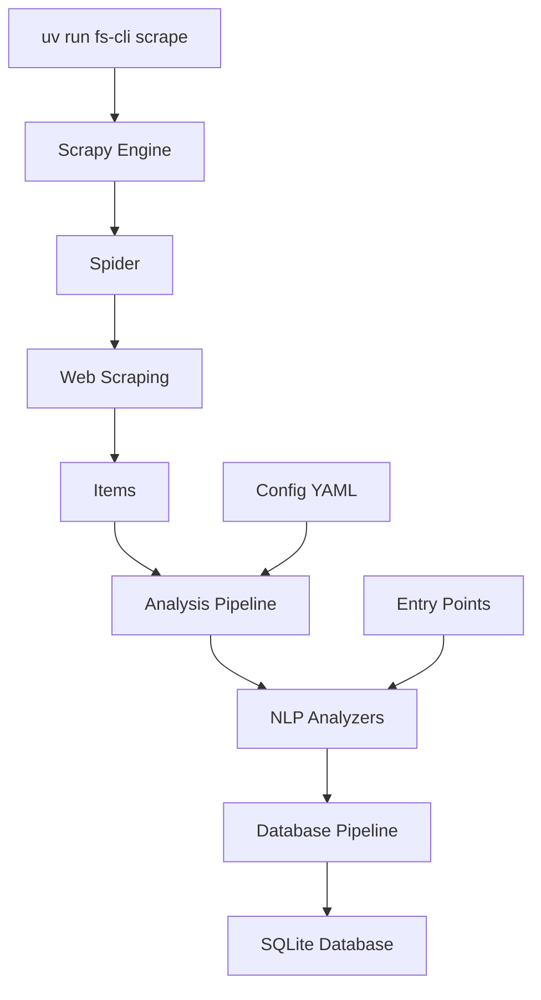

# 🕷️ Forums Scraper

**Zaawansowany scraper forów religijnych z równoległymi analizami NLP i bazami danych SQLite**

[](https://www.python.org/downloads/)
[](https://docs.astral.sh/uv/)
[](https://scrapy.org/)
[](https://spacy.io/)
[](https://rich.readthedocs.io/)

## 🎯 Opis projektu

Forums Scraper to profesjonalne narzędzie do scrapowania forów religijnych z zaawansowanymi funkcjami analizy tekstu. System został zaprojektowany z myślą o badaniach lingwistycznych, analizie sentymentu i modelowaniu tematów w kontekście dyskusji religijnych.

### 🎯 Główne cele

- **Badania naukowe**: Analiza dyskursu religijnego w internecie
- **Analiza sentymentu**: Badanie nastrojów w społecznościach religijnych
- **Modelowanie tematów**: Identyfikacja głównych tematów dyskusji
- **Archiwizacja**: Długoterminowe przechowywanie treści forów

## ✨ Kluczowe funkcjonalności

### 🔄 **Równoległe analizy NLP**

- **Tokenizacja podstawowa** - szybka analiza bez zależności zewnętrznych
- **Liczenie tokenów OpenAI** - estymacja kosztów API dla modeli językowych
- **Pełna analiza spaCy** - lematyzacja, POS tagging, dependency parsing
- **Analiza sentymentu** - wykrywanie emocji w tekście
- **Statystyki językowe** - czytelność, długość zdań, bogactwo słownictwa

### 🗄️ **Zaawansowana baza danych**

- **Osobne bazy SQLite** dla każdego forum
- **Pełny schemat relacyjny** - fora, sekcje, wątki, użytkownicy, posty
- **Tabele analiz** - tokeny, statystyki językowe, analiza morfosyntaktyczna, URL-e i domeny
- **Indeksy wydajnościowe** - szybkie zapytania analityczne
- **Automatyczne backupy** - bezpieczne przechowywanie danych

### 🎛️ **Profesjonalny CLI**

- **Rich interface** - kolorowy, interaktywny interfejs
- **Progress tracking** - śledzenie postępu w czasie rzeczywistym
- **Wybór forów** - elastyczna selekcja źródeł danych
- **Konfiguracja analiz** - dostosowanie do potrzeb badawczych
- **Dry-run mode** - testowanie bez wykonywania operacji
- **Status monitoring** - przegląd stanu baz danych

### ⚙️ **Elastyczna architektura**

- **Plugin system** - łatwe dodawanie nowych analizatorów
- **Entry points** - automatyczne wykrywanie dostępnych analiz
- **YAML/CLI configuration** - wygodna konfiguracja
- **Asynchronous processing** - wydajne przetwarzanie równoległe
- **Error handling** - odporna na błędy architektura

## 🚀 Instalacja i pierwsze uruchomienie

### Wymagania systemowe

- **Python 3.10+** (sprawdź: `python --version`)
- **uv** - nowoczesny menedżer pakietów Python ([instalacja](https://docs.astral.sh/uv/getting-started/installation/))
- **4GB RAM** (minimum), **8GB RAM** (zalecane dla spaCy)
- **Połączenie internetowe** dla scrapowania
- **~500MB** miejsca na dysku (zależnie od liczby forów)

### Krok 1: Instalacja uv (jeśli nie masz)

```bash
# macOS/Linux
curl -LsSf https://astral.sh/uv/install.sh | sh

# Windows (PowerShell)
powershell -c "irm https://astral.sh/uv/install.ps1 | iex"

# Sprawdź instalację
uv --version
```

### Krok 2: Pobranie kodu

```bash
# Klonowanie repozytorium
git clone https://github.com/username/forums_scraper.git
cd forums_scraper
```

### Krok 3: Instalacja z uv

#### **Opcja A: Instalacja podstawowa** (tylko scrapowanie)

```bash
uv pip install -e .
```

#### **Opcja B: Z analizatorami podstawowymi** (+ tiktoken)

```bash
uv pip install -e ".[analyzers-basic]"
```

#### **Opcja C: Z pełnymi analizatorami** (+ spaCy)

```bash
uv pip install -e ".[analyzers-linguistic]"
uv run python -m spacy download pl_core_news_lg
```

#### **Opcja D: Pełna instalacja** (zalecane)

```bash
uv pip install -e ".[all]"
uv run python -m spacy download pl_core_news_lg
```

#### **Opcja E: Z wirtualnym środowiskiem** (najbezpieczniejsze)

```bash
# Utwórz i aktywuj venv
uv venv
source .venv/bin/activate  # Linux/macOS
# lub .venv\Scripts\activate  # Windows

# Zainstaluj z pełnymi funkcjami
uv pip install -e ".[all]"
uv run python -m spacy download pl_core_news_lg
```

### Krok 4: Weryfikacja

```bash
# Sprawdź czy CLI działa
uv run fs-cli --help

# Lista dostępnych forów
uv run fs-cli list-spiders

# Lista dostępnych analizatorów
uv run fs-cli list-analyzers

# Test bez scrapowania
uv run fs-cli scrape --forum radio_katolik --dry-run
```

### Krok 5: Pierwsze uruchomienie

```bash
# Scrapuj jedno forum z podstawową analizą
uv run fs-cli scrape --forum radio_katolik --analysis basic_tokens

# Sprawdź wyniki
uv run fs-cli status
```

### Rozwiązywanie problemów instalacji

#### **Błąd "uv: command not found"**

```bash
# Zainstaluj uv
curl -LsSf https://astral.sh/uv/install.sh | sh
source ~/.bashrc  # lub ~/.zshrc

# Sprawdź instalację
uv --version
```

#### **Błąd "fs-cli: command not found"**

```bash
# Użyj uv run zamiast bezpośredniego wywołania
uv run fs-cli --help

# Jeśli używasz venv, upewnij się że jest aktywowany
source .venv/bin/activate
uv run fs-cli --help
```

#### **Błąd "spaCy model not found"**

```bash
uv run python -m spacy download pl_core_news_lg

# Lub większy model (lepszy, ale wolniejszy)
uv run python -m spacy download pl_core_news_lg
```

#### **Błąd "tiktoken not found"**

```bash
uv uv pip install tiktoken
```

#### **Problemy z pamięcią**

```bash
# Zmniejsz batch size dla analiz
uv run fs-cli scrape --batch-size 25
```

#### **Problemy z wirtualnym środowiskiem**

```bash
# Usuń i utwórz ponownie venv
rm -rf .venv
uv venv
source .venv/bin/activate
uv pip install -e ".[all]"
```

### Dlaczego uv?

- **⚡ Szybkość** - do 100x szybsza instalacja pakietów niż pip
- **🔒 Bezpieczeństwo** - automatyczna weryfikacja integralności pakietów
- **🎯 Prostota** - jednolity interfejs dla wszystkich operacji Python
- **🌍 Kompatybilność** - pełna zgodność z pip i PyPI
- **💾 Efektywność** - inteligentne cache'owanie i deduplikacja

## 🎮 Przewodnik użytkownika

### Podstawowe użycie

#### 1. **Scrapowanie wszystkich forów** (zalecane dla początkujących)

```bash
uv run fs-cli scrape
```

- Scrapuje wszystkie 4 fora
- Używa podstawowej tokenizacji
- Zapisuje do wspólnej bazy: `data/databases/forums_unified.db`

#### 2. **Scrapowanie konkretnego forum**

```bash
uv run fs-cli scrape --forum radio_katolik
```

#### 3. **Scrapowanie z analizą spaCy**

```bash
uv run fs-cli scrape --forum wiara --analysis spacy_full --sentiment
```

### Zaawansowane opcje

#### **Wybór wielu forów i analiz**

```bash
uv run fs-cli scrape \
  --forum wiara \
  --forum dolina_modlitwy \
  --analysis basic_tokens \
  --analysis spacy_full \
  --sentiment
```

#### **Optymalizacja wydajności**

```bash
uv run fs-cli scrape \
  --concurrent 32 \
  --delay 0.1 \
  --batch-size 200 \
  --forum radio_katolik
```

#### **Tryb testowy (bez scrapowania)**

```bash
uv run fs-cli scrape --forum wiara --analysis all --dry-run
```

### Zarządzanie danymi

#### **Status baz danych**

```bash
uv run fs-cli status
```

Wyświetla:

- Rozmiary plików baz danych
- Liczba postów w każdej bazie
- Daty ostatniej modyfikacji

#### **Tworzenie konfiguracji**

```bash
# Utwórz plik konfiguracyjny
uv run fs-cli config --analysis spacy_full --sentiment --output my_config.yaml

# Użyj własnej konfiguracji
uv run fs-cli scrape --config my_config.yaml
```

## 📋 Dostępne fora

| Forum               | Kod               | Opis                                   | Szacowana wielkość |
| ------------------- | ----------------- | -------------------------------------- | ------------------ |
| **Dolina Modlitwy** | `dolina_modlitwy` | Forum katolickie, modlitwy i duchowość | ~50MB              |
| **Radio Katolik**   | `radio_katolik`   | Forum Radia Katolik, aktualności       | ~30MB              |
| **Wiara.pl**        | `wiara`           | Największe polskie forum katolickie    | ~100MB             |
| **Z Chrystusem**    | `z_chrystusem`    | Forum ewangelickie                     | ~40MB              |

### Wybór forów

```bash
# Pojedyncze forum
--forum radio_katolik

# Wiele forów
--forum wiara --forum dolina_modlitwy

# Wszystkie fora (domyślne)
--forum all
```

## 🔬 Typy analiz NLP

### 1. **Podstawowa tokenizacja** (`basic_tokens`)

```yaml
- name: basic_tokenizer
  config:
    lowercase: true # Konwersja na małe litery
    min_token_length: 2 # Minimalna długość tokena
    remove_punctuation: false # Zachowanie interpunkcji
```

**Wyniki:**

- Lista tokenów
- Liczba tokenów (total/unique)
- Średnia długość tokena

**Zalety:** Szybka, bez zależności zewnętrznych
**Wady:** Podstawowa jakość tokenizacji

### 2. **Liczenie tokenów OpenAI** (`token_count`)

```yaml
- name: token_counter
  config:
    encoding: cl100k_base # Model tokenizacji OpenAI
```

**Wyniki:**

- Dokładna liczba tokenów OpenAI
- Estymacja kosztów API

**Zalety:** Precyzyjne dla modeli OpenAI
**Wady:** Wymaga biblioteki tiktoken

### 3. **Pełna analiza spaCy** (`spacy_full`)

```yaml
- name: spacy_analyzer
  config:
    model: pl_core_news_lg # Model języka polskiego (duży, najlepszy)
    include_sentiment: true # Włącz analizę sentymentu
    batch_size: 100 # Rozmiar batcha
    max_length: 1000000 # Maks. długość tekstu
```

**Komponenty spaCy wykorzystywane:**

- **tok2vec** - wektoryzacja tokenów (automatycznie)
- **morphologizer** - cechy morfologiczne (przypadek, liczba, rodzaj)
- **parser** - analiza składniowa (dependency parsing)
- **lemmatizer** - lematyzacja (formy podstawowe)
- **tagger** - tagowanie części mowy (POS)
- **senter** - segmentacja zdań
- **ner** - rozpoznawanie nazw własnych

**Wyniki linguistyczne:**

- **Lematyzacja** - forma podstawowa słów
- **POS tagging** - części mowy (rzeczownik, czasownik, etc.)
- **Dependency parsing** - relacje składniowe
- **Named Entity Recognition** - osoby, organizacje, miejsca, wydarzenia
- **Analiza sentymentu** - polarność emocjonalna z rozszerzonym słownictwem religijnym

**Statystyki tekstowe:**

- Liczba zdań, słów, znaków
- Średnia długość zdania
- Wskaźnik czytelności
- Wykrywanie języka

**Zalety:** Najwyższa jakość analizy
**Wady:** Wymaga spaCy i modelu językowego

### 4. **Analiza URL-ów** (`url_analysis`)

```yaml
- name: url_analyzer
  config:
    include_domain_analysis: true # Kategoryzacja domen
    include_url_categorization: true # Klasyfikacja URL-ów
    max_urls_per_post: 50 # Limit URL-ów per post
```

**Funkcje:**

- **Kategoryzacja domen** - religijne, media, społecznościowe, edukacyjne
- **Klasyfikacja URL-ów** - artykuły, wideo, obrazy, social media
- **Ocena wiarygodności** - trust score dla domen (0.0-1.0)
- **Statystyki** - liczba domen, typy linków per post
- **Deduplikacja** - unikalne domeny w bazie

**Kategorie domen:**

- **Religijne**: catholic.pl, vatican.va, opoka.org.pl, radiomaryja.pl
- **Media**: youtube.com, tvp.pl, gazeta.pl, onet.pl
- **Społecznościowe**: facebook.com, twitter.com, instagram.com
- **Edukacyjne**: wikipedia.org, academia.edu, scholar.google.com

**Zalety:** Szczegółowa analiza linków, kategorie polskie
**Wady:** Brak

### 5. **Statystyki domen** (`domain_stats`)

```yaml
- name: domain_stats
  config:
    track_popularity: true # Śledzenie popularności domen
```

**Funkcje:**

- Podstawowe liczenie URL-ów i domen
- Szybka analiza bez kategoryzacji
- Deduplikacja domen

**Zalety:** Szybka, lekka
**Wady:** Brak kategoryzacji

### 6. **Wszystkie analizy** (`all`)

Włącza wszystkie dostępne analizatory: tokeny + spaCy + URL-e + domeny.

## 🗄️ Struktura bazy danych

**Wspólna baza SQLite:** `data/databases/forums_unified.db`

Wszystkie fora, posty i analizy są przechowywane w jednej bazie danych, co umożliwia:

- **Analizy porównawcze** między forami
- **Łatwiejsze zapytania** SQL
- **Prostsze zarządzanie** danymi
- **Efektywniejsze** przechowywanie

### Tabele główne

#### **forums** - Informacje o forach

```sql
CREATE TABLE forums (
    id TEXT PRIMARY KEY,
    spider_name TEXT NOT NULL,
    title TEXT,
    created_at TIMESTAMP,
    updated_at TIMESTAMP
);
```

#### **sections** - Sekcje forów

```sql
CREATE TABLE sections (
    id TEXT PRIMARY KEY,
    forum_id TEXT,
    title TEXT,
    url TEXT,
    created_at TIMESTAMP,
    updated_at TIMESTAMP,
    FOREIGN KEY (forum_id) REFERENCES forums (id)
);
```

#### **threads** - Wątki dyskusji

```sql
CREATE TABLE threads (
    id TEXT PRIMARY KEY,
    section_id TEXT,
    title TEXT,
    url TEXT,
    author TEXT,
    replies INTEGER,
    views INTEGER,
    last_post_date TEXT,
    last_post_author TEXT,
    created_at TIMESTAMP,
    updated_at TIMESTAMP,
    FOREIGN KEY (section_id) REFERENCES sections (id)
);
```

#### **users** - Użytkownicy forów

```sql
CREATE TABLE users (
    id TEXT PRIMARY KEY,
    username TEXT UNIQUE,
    join_date TEXT,
    posts_count INTEGER,
    religion TEXT,
    gender TEXT,
    localization TEXT,
    created_at TIMESTAMP,
    updated_at TIMESTAMP
);
```

#### **posts** - Posty użytkowników

```sql
CREATE TABLE posts (
    id TEXT PRIMARY KEY,
    thread_id TEXT,
    user_id TEXT,
    post_number INTEGER,
    content TEXT,
    content_urls TEXT,  -- JSON z URL-ami
    post_date TEXT,
    url TEXT,
    username TEXT,
    created_at TIMESTAMP,
    updated_at TIMESTAMP,
    FOREIGN KEY (thread_id) REFERENCES threads (id),
    FOREIGN KEY (user_id) REFERENCES users (id)
);
```

### Tabele analiz NLP

#### **post_tokens** - Tokeny postów

```sql
CREATE TABLE post_tokens (
    id INTEGER PRIMARY KEY AUTOINCREMENT,
    post_id TEXT,
    token TEXT,
    position INTEGER,
    created_at TIMESTAMP,
    FOREIGN KEY (post_id) REFERENCES posts (id)
);
```

#### **post_token_stats** - Statystyki tokenów

```sql
CREATE TABLE post_token_stats (
    post_id TEXT PRIMARY KEY,
    total_tokens INTEGER,
    unique_tokens INTEGER,
    avg_token_length REAL,
    created_at TIMESTAMP,
    FOREIGN KEY (post_id) REFERENCES posts (id)
);
```

#### **post_linguistic_analysis** - Analiza morfosyntaktyczna

```sql
CREATE TABLE post_linguistic_analysis (
    id INTEGER PRIMARY KEY AUTOINCREMENT,
    post_id TEXT,
    token TEXT,
    lemma TEXT,           -- Forma podstawowa
    pos TEXT,             -- Część mowy
    tag TEXT,             -- Szczegółowy tag
    dep TEXT,             -- Relacja składniowa
    morph_features TEXT,  -- Cechy morfologiczne (JSON: przypadek, liczba, rodzaj)
    is_alpha BOOLEAN,     -- Czy alfanumeryczny
    is_stop BOOLEAN,      -- Czy stop word
    is_punct BOOLEAN,     -- Czy interpunkcja
    sentiment_score REAL, -- Wynik sentymentu
    created_at TIMESTAMP,
    FOREIGN KEY (post_id) REFERENCES posts (id)
);
```

#### **post_linguistic_stats** - Statystyki językowe

```sql
CREATE TABLE post_linguistic_stats (
    post_id TEXT PRIMARY KEY,
    sentence_count INTEGER,      -- Liczba zdań
    word_count INTEGER,          -- Liczba słów
    char_count INTEGER,          -- Liczba znaków
    avg_sentence_length REAL,    -- Średnia długość zdania
    readability_score REAL,      -- Wskaźnik czytelności
    sentiment_polarity REAL,     -- Polarność sentymentu (-1 do 1)
    sentiment_subjectivity REAL, -- Subiektywność (0 do 1)
    language_detected TEXT,      -- Wykryty język
    created_at TIMESTAMP,
    FOREIGN KEY (post_id) REFERENCES posts (id)
);
```

#### **domains** - Katalog domen

```sql
CREATE TABLE domains (
    id INTEGER PRIMARY KEY AUTOINCREMENT,
    domain TEXT UNIQUE NOT NULL,     -- Nazwa domeny (np. "youtube.com")
    category TEXT,                   -- Kategoria: 'religious', 'media', 'social', 'educational', 'unknown'
    is_religious BOOLEAN DEFAULT 0,  -- Czy domena religijna
    is_media BOOLEAN DEFAULT 0,      -- Czy domena medialna
    is_social BOOLEAN DEFAULT 0,     -- Czy domena społecznościowa
    is_educational BOOLEAN DEFAULT 0,-- Czy domena edukacyjna
    trust_score REAL DEFAULT 0.5,    -- Wskaźnik wiarygodności (0.0-1.0)
    first_seen TIMESTAMP,            -- Pierwsze wystąpienie
    last_seen TIMESTAMP,             -- Ostatnie wystąpienie
    total_references INTEGER DEFAULT 0, -- Liczba odniesień
    created_at TIMESTAMP
);
```

#### **post_urls** - URL-e z postów

```sql
CREATE TABLE post_urls (
    id INTEGER PRIMARY KEY AUTOINCREMENT,
    post_id TEXT,                    -- ID posta
    url TEXT,                        -- Pełny URL
    domain_id INTEGER,               -- Odniesienie do tabeli domains
    url_type TEXT,                   -- Typ: 'article', 'video', 'image', 'social', 'unknown'
    is_external BOOLEAN DEFAULT 1,   -- Czy link zewnętrzny
    created_at TIMESTAMP,
    FOREIGN KEY (post_id) REFERENCES posts (id),
    FOREIGN KEY (domain_id) REFERENCES domains (id)
);
```

#### **post_url_stats** - Statystyki URL-ów per post

```sql
CREATE TABLE post_url_stats (
    post_id TEXT PRIMARY KEY,
    total_urls INTEGER DEFAULT 0,       -- Całkowita liczba URL-ów
    unique_domains INTEGER DEFAULT 0,   -- Liczba unikalnych domen
    religious_urls INTEGER DEFAULT 0,   -- Liczba linków religijnych
    media_urls INTEGER DEFAULT 0,       -- Liczba linków medialnych
    social_urls INTEGER DEFAULT 0,      -- Liczba linków społecznościowych
    educational_urls INTEGER DEFAULT 0, -- Liczba linków edukacyjnych
    unknown_urls INTEGER DEFAULT 0,     -- Liczba niekategoryzowanych linków
    created_at TIMESTAMP,
    FOREIGN KEY (post_id) REFERENCES posts (id)
);
```

#### **post_named_entities** - Named Entities (nazwy własne)

```sql
CREATE TABLE post_named_entities (
    id INTEGER PRIMARY KEY AUTOINCREMENT,
    post_id TEXT,                    -- ID posta
    entity_text TEXT,                -- Tekst encji (np. "Jan Paweł II")
    entity_label TEXT,               -- Typ: PERSON, ORG, GPE, EVENT, etc.
    entity_description TEXT,         -- Opis typu encji
    start_char INTEGER,              -- Pozycja początkowa w tekście
    end_char INTEGER,                -- Pozycja końcowa w tekście
    created_at TIMESTAMP,
    FOREIGN KEY (post_id) REFERENCES posts (id)
);
```

#### **post_ner_stats** - Statystyki Named Entities per post

```sql
CREATE TABLE post_ner_stats (
    post_id TEXT PRIMARY KEY,
    total_entities INTEGER DEFAULT 0,    -- Całkowita liczba encji
    person_entities INTEGER DEFAULT 0,   -- Osoby (Jan Paweł II, św. Teresa)
    org_entities INTEGER DEFAULT 0,      -- Organizacje (Kościół, Watykan)
    gpe_entities INTEGER DEFAULT 0,      -- Miejsca (Rzym, Polska, Kraków)
    event_entities INTEGER DEFAULT 0,    -- Wydarzenia (Wielkanoc, Boże Narodzenie)
    other_entities INTEGER DEFAULT 0,    -- Inne encje
    created_at TIMESTAMP,
    FOREIGN KEY (post_id) REFERENCES posts (id)
);
```

## 📊 Przykłady analiz SQL

### Podstawowe statystyki

#### **Przegląd forów w wspólnej bazie**

```sql
-- Porównanie aktywności między forami
SELECT
    f.spider_name as forum,
    f.title,
    COUNT(DISTINCT p.id) as posts_count,
    COUNT(DISTINCT p.user_id) as users_count,
    COUNT(DISTINCT t.id) as threads_count,
    MIN(p.created_at) as first_post,
    MAX(p.created_at) as last_post
FROM forums f
LEFT JOIN sections s ON f.id = s.forum_id
LEFT JOIN threads t ON s.id = t.section_id
LEFT JOIN posts p ON t.id = p.thread_id
GROUP BY f.id, f.spider_name, f.title
ORDER BY posts_count DESC;
```

#### **Najaktywniejsze sekcje**

```sql
SELECT
    s.title as section,
    COUNT(p.id) as posts_count,
    COUNT(DISTINCT t.id) as threads_count
FROM sections s
JOIN threads t ON s.id = t.section_id
JOIN posts p ON t.id = p.thread_id
GROUP BY s.id, s.title
ORDER BY posts_count DESC
LIMIT 10;
```

#### **Top użytkownicy**

```sql
SELECT
    u.username,
    COUNT(p.id) as posts_count,
    u.join_date,
    u.religion,
    u.gender
FROM users u
JOIN posts p ON u.id = p.user_id
GROUP BY u.id, u.username
ORDER BY posts_count DESC
LIMIT 20;
```

### Analizy językowe

#### **Najczęściej używane słowa**

```sql
-- Top lematy (formy podstawowe słów)
SELECT
    lemma,
    COUNT(*) as frequency,
    COUNT(DISTINCT post_id) as posts_with_word
FROM post_linguistic_analysis
WHERE is_alpha = 1
  AND is_stop = 0
  AND LENGTH(lemma) > 3
GROUP BY lemma
ORDER BY frequency DESC
LIMIT 50;
```

#### **Analiza części mowy**

```sql
-- Rozkład części mowy
SELECT
    pos,
    COUNT(*) as count,
    ROUND(COUNT(*) * 100.0 / SUM(COUNT(*)) OVER(), 2) as percentage
FROM post_linguistic_analysis
WHERE is_alpha = 1
GROUP BY pos
ORDER BY count DESC;
```

#### **Analiza cech morfologicznych**

```sql
-- Analiza przypadków rzeczowników (wykorzystanie morphologizer)
SELECT
    json_extract(morph_features, '$.Case') as case_form,
    COUNT(*) as frequency,
    COUNT(DISTINCT post_id) as posts_count
FROM post_linguistic_analysis
WHERE pos = 'NOUN'
  AND json_extract(morph_features, '$.Case') IS NOT NULL
GROUP BY json_extract(morph_features, '$.Case')
ORDER BY frequency DESC;
```

#### **Analiza rodzaju gramatycznego**

```sql
-- Rozkład rodzaju gramatycznego w tekstach religijnych
SELECT
    f.spider_name as forum,
    json_extract(pla.morph_features, '$.Gender') as gender,
    COUNT(*) as frequency
FROM forums f
JOIN sections s ON f.id = s.forum_id
JOIN threads t ON s.id = t.section_id
JOIN posts p ON t.id = p.thread_id
JOIN post_linguistic_analysis pla ON p.id = pla.post_id
WHERE pla.pos IN ('NOUN', 'ADJ')
  AND json_extract(pla.morph_features, '$.Gender') IS NOT NULL
GROUP BY f.spider_name, json_extract(pla.morph_features, '$.Gender')
ORDER BY f.spider_name, frequency DESC;
```

#### **Analiza sentymentu**

```sql
-- Posty z najwyższym sentymentem pozytywnym
SELECT
    f.spider_name as forum,
    p.content,
    pls.sentiment_polarity,
    pls.sentiment_subjectivity,
    u.username,
    p.post_date
FROM posts p
JOIN post_linguistic_stats pls ON p.id = pls.post_id
JOIN users u ON p.user_id = u.id
JOIN threads t ON p.thread_id = t.id
JOIN sections s ON t.section_id = s.id
JOIN forums f ON s.forum_id = f.id
WHERE pls.sentiment_polarity > 0.5
ORDER BY pls.sentiment_polarity DESC
LIMIT 10;
```

#### **Porównanie sentymentu między forami**

```sql
-- Średni sentyment na forum
SELECT
    f.spider_name as forum,
    COUNT(pls.post_id) as analyzed_posts,
    ROUND(AVG(pls.sentiment_polarity), 3) as avg_sentiment,
    ROUND(AVG(pls.sentiment_subjectivity), 3) as avg_subjectivity,
    ROUND(AVG(pls.readability_score), 1) as avg_readability
FROM forums f
JOIN sections s ON f.id = s.forum_id
JOIN threads t ON s.id = t.section_id
JOIN posts p ON t.id = p.thread_id
JOIN post_linguistic_stats pls ON p.id = pls.post_id
GROUP BY f.id, f.spider_name
HAVING analyzed_posts > 50
ORDER BY avg_sentiment DESC;
```

#### **Statystyki czytelności**

```sql
-- Średnie wskaźniki czytelności po sekcjach
SELECT
    s.title as section,
    COUNT(pls.post_id) as analyzed_posts,
    ROUND(AVG(pls.readability_score), 2) as avg_readability,
    ROUND(AVG(pls.avg_sentence_length), 2) as avg_sentence_len,
    ROUND(AVG(pls.word_count), 0) as avg_words
FROM sections s
JOIN threads t ON s.id = t.section_id
JOIN posts p ON t.id = p.thread_id
JOIN post_linguistic_stats pls ON p.id = pls.post_id
GROUP BY s.id, s.title
HAVING analyzed_posts > 100
ORDER BY avg_readability DESC;
```

#### **Analiza tematyczna przez słowa kluczowe**

```sql
-- Posty zawierające słowa religijne z podziałem na fora
SELECT
    f.spider_name as forum,
    COUNT(DISTINCT p.id) as posts_with_keywords,
    COUNT(DISTINCT pla.lemma) as unique_religious_words
FROM posts p
JOIN threads t ON p.thread_id = t.id
JOIN sections s ON t.section_id = s.id
JOIN forums f ON s.forum_id = f.id
JOIN post_linguistic_analysis pla ON p.id = pla.post_id
WHERE pla.lemma IN ('bóg', 'jezus', 'chrystus', 'modlitwa', 'wiara', 'kościół')
  AND pla.is_alpha = 1
GROUP BY f.id, f.spider_name
ORDER BY posts_with_keywords DESC;
```

#### **Analiza słownictwa religijnego między forami**

```sql
-- Najczęściej używane słowa religijne per forum
SELECT
    f.spider_name as forum,
    pla.lemma,
    COUNT(*) as frequency,
    COUNT(DISTINCT p.id) as posts_count
FROM forums f
JOIN sections s ON f.id = s.forum_id
JOIN threads t ON s.id = t.section_id
JOIN posts p ON t.id = p.thread_id
JOIN post_linguistic_analysis pla ON p.id = pla.post_id
WHERE pla.lemma IN ('bóg', 'jezus', 'chrystus', 'modlitwa', 'wiara', 'kościół', 'duch', 'święty')
  AND pla.is_alpha = 1
GROUP BY f.spider_name, pla.lemma
ORDER BY f.spider_name, frequency DESC;
```

### Analizy domen i URL-ów

#### **Najpopularniejsze domeny**

```sql
-- Top domeny linkowane w postach
SELECT
    d.domain,
    d.category,
    d.total_references,
    COUNT(DISTINCT pu.post_id) as posts_with_domain
FROM domains d
JOIN post_urls pu ON d.id = pu.domain_id
GROUP BY d.id, d.domain, d.category
ORDER BY d.total_references DESC
LIMIT 20;
```

#### **Analiza domen religijnych**

```sql
-- Domeny religijne per forum
SELECT
    f.spider_name as forum,
    COUNT(DISTINCT d.domain) as religious_domains,
    SUM(d.total_references) as total_religious_links
FROM forums f
JOIN sections s ON f.id = s.forum_id
JOIN threads t ON s.id = t.section_id
JOIN posts p ON t.id = p.thread_id
JOIN post_urls pu ON p.id = pu.post_id
JOIN domains d ON pu.domain_id = d.id
WHERE d.is_religious = 1
GROUP BY f.spider_name
ORDER BY total_religious_links DESC;
```

#### **Typy URL-ów per forum**

```sql
-- Rozkład typów URL-ów
SELECT
    f.spider_name as forum,
    pu.url_type,
    COUNT(*) as count,
    COUNT(DISTINCT pu.post_id) as posts_count
FROM forums f
JOIN sections s ON f.id = s.forum_id
JOIN threads t ON s.id = t.section_id
JOIN posts p ON t.id = p.thread_id
JOIN post_urls pu ON p.id = pu.post_id
GROUP BY f.spider_name, pu.url_type
ORDER BY f.spider_name, count DESC;
```

#### **Wiarygodność źródeł**

```sql
-- Średnia wiarygodność linkowanych domen per forum
SELECT
    f.spider_name as forum,
    COUNT(DISTINCT d.domain) as unique_domains,
    ROUND(AVG(d.trust_score), 3) as avg_trust_score,
    COUNT(CASE WHEN d.trust_score >= 0.8 THEN 1 END) as high_trust_domains,
    COUNT(CASE WHEN d.trust_score < 0.6 THEN 1 END) as low_trust_domains
FROM forums f
JOIN sections s ON f.id = s.forum_id
JOIN threads t ON s.id = t.section_id
JOIN posts p ON t.id = p.thread_id
JOIN post_urls pu ON p.id = pu.post_id
JOIN domains d ON pu.domain_id = d.id
GROUP BY f.spider_name
ORDER BY avg_trust_score DESC;
```

### Analizy Named Entities (NER)

#### **Najczęściej wymieniane osoby**

```sql
-- Top osoby religijne w dyskusjach
SELECT
    f.spider_name as forum,
    pne.entity_text as person,
    COUNT(*) as mentions,
    COUNT(DISTINCT pne.post_id) as posts_count
FROM forums f
JOIN sections s ON f.id = s.forum_id
JOIN threads t ON s.id = t.section_id
JOIN posts p ON t.id = p.thread_id
JOIN post_named_entities pne ON p.id = pne.post_id
WHERE pne.entity_label IN ('PERSON', 'PER')
GROUP BY f.spider_name, pne.entity_text
HAVING mentions > 5
ORDER BY f.spider_name, mentions DESC;
```

#### **Organizacje religijne**

```sql
-- Najczęściej wymieniane organizacje
SELECT
    pne.entity_text as organization,
    COUNT(*) as mentions,
    COUNT(DISTINCT f.spider_name) as forums_mentioned
FROM post_named_entities pne
JOIN posts p ON pne.post_id = p.id
JOIN threads t ON p.thread_id = t.id
JOIN sections s ON t.section_id = s.id
JOIN forums f ON s.forum_id = f.id
WHERE pne.entity_label IN ('ORG', 'ORGANIZATION')
GROUP BY pne.entity_text
ORDER BY mentions DESC
LIMIT 15;
```

#### **Miejsca geograficzne**

```sql
-- Miejsca religijne w dyskusjach
SELECT
    f.spider_name as forum,
    pne.entity_text as place,
    COUNT(*) as mentions
FROM forums f
JOIN sections s ON f.id = s.forum_id
JOIN threads t ON s.id = t.section_id
JOIN posts p ON t.id = p.thread_id
JOIN post_named_entities pne ON p.id = pne.post_id
WHERE pne.entity_label IN ('GPE', 'LOC', 'LOCATION')
  AND (pne.entity_text LIKE '%Watykan%'
    OR pne.entity_text LIKE '%Rzym%'
    OR pne.entity_text LIKE '%Kraków%'
    OR pne.entity_text LIKE '%Częstochowa%')
GROUP BY f.spider_name, pne.entity_text
ORDER BY f.spider_name, mentions DESC;
```

#### **Statystyki NER per forum**

```sql
-- Porównanie rozpoznawania encji między forami
SELECT
    f.spider_name as forum,
    COUNT(DISTINCT pns.post_id) as posts_with_entities,
    SUM(pns.total_entities) as total_entities,
    SUM(pns.person_entities) as persons,
    SUM(pns.org_entities) as organizations,
    SUM(pns.gpe_entities) as places,
    ROUND(AVG(pns.total_entities), 2) as avg_entities_per_post
FROM forums f
JOIN sections s ON f.id = s.forum_id
JOIN threads t ON s.id = t.section_id
JOIN posts p ON t.id = p.thread_id
JOIN post_ner_stats pns ON p.id = pns.post_id
GROUP BY f.spider_name
ORDER BY total_entities DESC;
```

### Analizy temporalne

#### **Aktywność w czasie**

```sql
-- Liczba postów po miesiącach
SELECT
    strftime('%Y-%m', created_at) as month,
    COUNT(*) as posts_count
FROM posts
WHERE created_at IS NOT NULL
GROUP BY month
ORDER BY month;
```

#### **Ewolucja sentymentu**

```sql
-- Średni sentyment po miesiącach
SELECT
    strftime('%Y-%m', p.created_at) as month,
    COUNT(pls.post_id) as posts_analyzed,
    ROUND(AVG(pls.sentiment_polarity), 3) as avg_sentiment,
    ROUND(AVG(pls.readability_score), 1) as avg_readability
FROM posts p
JOIN post_linguistic_stats pls ON p.id = pls.post_id
WHERE p.created_at IS NOT NULL
GROUP BY month
HAVING posts_analyzed > 10
ORDER BY month;
```

## ⚙️ Konfiguracja zaawansowana

### Plik konfiguracyjny YAML

#### **Podstawowa konfiguracja**

```yaml
# config.yaml
analysis:
  enabled: true
  analyzers:
    - name: basic_tokenizer
      config:
        lowercase: true
        min_token_length: 2

    - name: token_counter
      config:
        encoding: cl100k_base

  concurrency: 4

scrapy:
  concurrent_requests: 16
  download_delay: 0.5
  autothrottle: true
```

#### **Konfiguracja produkcyjna**

```yaml
# production_config.yaml
analysis:
  enabled: true
  analyzers:
    - name: basic_tokenizer
      config:
        lowercase: true
        min_token_length: 2
        remove_punctuation: false

    - name: token_counter
      config:
        encoding: cl100k_base

    - name: spacy_analyzer
      config:
        model: pl_core_news_lg
        include_sentiment: true
        batch_size: 200
        max_length: 1000000

  concurrency: 8

scrapy:
  concurrent_requests: 32
  concurrent_requests_per_domain: 16
  download_delay: 0.2
  randomize_download_delay: true
  autothrottle: true
  autothrottle_start_delay: 0.1
  autothrottle_max_delay: 2.0
  autothrottle_target_concurrency: 24.0
```

### Optymalizacja wydajności

#### **Dla szybkiego scrapowania**

```bash
uv run fs-cli scrape \
  --concurrent 64 \
  --delay 0.1 \
  --analysis basic_tokens \
  --forum radio_katolik
```

#### **Dla dokładnej analizy**

```bash
uv run fs-cli scrape \
  --concurrent 8 \
  --delay 1.0 \
  --batch-size 50 \
  --analysis all \
  --sentiment \
  --spacy-model pl_core_news_lg
```

#### **Dla ograniczonych zasobów**

```bash
uv run fs-cli scrape \
  --concurrent 4 \
  --delay 2.0 \
  --batch-size 25 \
  --analysis basic_tokens \
  --forum dolina_modlitwy
```

## 🔧 Rozwiązywanie problemów

### Częste problemy

#### **1. Błąd "spaCy model not found"**

```bash
# Rozwiązanie
python -m spacy download pl_core_news_lg

# Lub większy model (lepszy, ale wolniejszy)
python -m spacy download pl_core_news_lg
```

#### **2. Błąd "tiktoken not found"**

```bash
# Rozwiązanie
uv pip install tiktoken
```

#### **3. Problemy z pamięcią podczas analizy spaCy**

```bash
# Zmniejsz batch size
uv run fs-cli scrape --batch-size 25 --analysis spacy_full

# Lub użyj mniejszego modelu
uv run fs-cli scrape --spacy-model pl_core_news_lg
```

#### **4. Zbyt wolne scrapowanie**

```bash
# Zwiększ równoległość (ostrożnie!)
uv run fs-cli scrape --concurrent 32 --delay 0.2

# Wyłącz analizy dla szybszego scrapowania
uv run fs-cli scrape --analysis none
```

#### **5. Błędy połączenia sieciowego**

```bash
# Zwiększ opóźnienia
uv run fs-cli scrape --delay 2.0 --concurrent 8

# Sprawdź połączenie internetowe
ping google.com
```

### Debugowanie

#### **Włącz szczegółowe logi**

```bash
uv run fs-cli scrape --verbose --forum radio_katolik
```

#### **Testuj bez scrapowania**

```bash
uv run fs-cli scrape --dry-run --analysis all
```

#### **Sprawdź status baz danych**

```bash
uv run fs-cli status
```

## 📊 Monitorowanie podczas scrapowania

### **Real-time monitoring (zalecane)**

#### **Terminal 1: Uruchom scrapowanie**

```bash
uv run fs-cli scrape \
  --forum all \
  --analysis all \
  --sentiment \
  --spacy-model pl_core_news_lg \
  --concurrent 8 \
  --delay 0.3 \
  --verbose
```

#### **Terminal 2: Monitoruj postęp bazy danych**

```bash
# Odświeżaj co 10 sekund
watch -n 10 'uv run fs-cli status'

# Lub sprawdzaj ręcznie
while true; do
  clear
  echo "=== $(date) ==="
  uv run fs-cli status
  sleep 15
done
```

#### **Terminal 3: Monitoruj zasoby systemowe**

```bash
# Monitoruj proces fs-cli
top -pid $(pgrep -f fs-cli)

# Lub wszystkie procesy Python
top -o cpu -stats pid,command,cpu,mem,time | grep python

# Monitoruj pamięć
watch -n 5 'ps aux | grep fs-cli | grep -v grep'
```

#### **Terminal 4: Monitoruj rozmiar bazy**

```bash
# Rozmiar bazy danych
watch -n 30 'ls -lh data/databases/forums_unified.db'

# Szczegółowe info o pliku
watch -n 30 'stat data/databases/forums_unified.db'
```

### **Monitoring zaawansowany**

#### **Sprawdź postęp scrapowania**

```bash
# Liczba itemów w czasie rzeczywistym
watch -n 5 'sqlite3 data/databases/forums_unified.db "
SELECT
  f.spider_name,
  COUNT(p.id) as posts,
  COUNT(DISTINCT t.id) as threads,
  COUNT(DISTINCT u.id) as users
FROM forums f
LEFT JOIN sections s ON f.id = s.forum_id
LEFT JOIN threads t ON s.id = t.section_id
LEFT JOIN posts p ON t.id = p.thread_id
LEFT JOIN users u ON p.user_id = u.id
GROUP BY f.spider_name;"'
```

#### **Monitoruj wydajność analiz**

```bash
# Sprawdź postęp analiz
watch -n 10 'sqlite3 data/databases/forums_unified.db "
SELECT
  \"Tokenizacja\" as analiza, COUNT(*) as przeanalizowane FROM post_token_stats
UNION ALL
SELECT
  \"Językowa\" as analiza, COUNT(*) as przeanalizowane FROM post_linguistic_stats
UNION ALL
SELECT
  \"NER\" as analiza, COUNT(*) as przeanalizowane FROM post_ner_stats
UNION ALL
SELECT
  \"URL-e\" as analiza, COUNT(*) as przeanalizowane FROM post_url_stats;"'
```

#### **Sprawdź błędy i ostrzeżenia**

```bash
# Monitoruj logi Scrapy (jeśli --verbose)
tail -f scrapy.log

# Lub sprawdź błędy systemowe
dmesg | tail -20
```

### **Wskaźniki wydajności**

#### **Optymalne wartości:**

- **CPU**: 60-80% (dla 8 wątków)
- **RAM**: 4-8GB (z modelem lg)
- **Items/min**: 100-500 (zależnie od forum)
- **Requests/min**: 200-1000 (zależnie od --delay)

#### **Sygnały problemów:**

- **CPU > 95%**: Zmniejsz `--concurrent` lub `--batch-size`
- **RAM > 12GB**: Zmniejsz `--batch-size` lub użyj modelu sm
- **Items/min < 50**: Zwiększ `--concurrent` lub zmniejsz `--delay`
- **Błędy HTTP**: Zwiększ `--delay`

### **Komendy diagnostyczne**

#### **Sprawdź aktywne połączenia**

```bash
netstat -an | grep :80 | wc -l  # HTTP connections
netstat -an | grep :443 | wc -l # HTTPS connections
```

#### **Sprawdź wykorzystanie dysku**

```bash
df -h .  # Dostępne miejsce
du -sh data/databases/  # Rozmiar katalogu baz
```

#### **Sprawdź logi błędów**

```bash
# Ostatnie błędy
grep -i error ~/.scrapy/logs/* | tail -10

# Sprawdź czy proces działa
ps aux | grep fs-cli | grep -v grep
```

### **Przykład pełnego workflow'u monitorowania**

#### **Przygotowanie (Terminal 1):**

```bash
# Sprawdź stan przed rozpoczęciem
uv run fs-cli status

# Uruchom kompleksowe scrapowanie
uv run fs-cli scrape \
  --forum all \
  --analysis all \
  --sentiment \
  --spacy-model pl_core_news_lg \
  --concurrent 8 \
  --delay 0.3 \
  --verbose
```

#### **Monitoring (Terminal 2):**

```bash
# Skrypt monitorujący - zapisz jako monitor.sh
#!/bin/bash
while true; do
  clear
  echo "=== FORUMS SCRAPER MONITORING - $(date) ==="
  echo

  # Status bazy danych
  echo "📊 STATUS BAZY DANYCH:"
  uv run fs-cli status
  echo

  # Zasoby systemowe
  echo "💻 ZASOBY SYSTEMOWE:"
  ps aux | grep fs-cli | grep -v grep | head -3
  echo

  # Rozmiar bazy
  echo "📁 ROZMIAR BAZY:"
  ls -lh data/databases/forums_unified.db 2>/dev/null || echo "Baza nie istnieje"
  echo

  sleep 30
done

# Uruchom monitoring
chmod +x monitor.sh && ./monitor.sh
```

#### **Analiza postępu (Terminal 3):**

```bash
# Real-time SQL monitoring
watch -n 15 'echo "POSTĘP SCRAPOWANIA:" && sqlite3 data/databases/forums_unified.db "
SELECT
  f.spider_name as Forum,
  COUNT(DISTINCT s.id) as Sekcje,
  COUNT(DISTINCT t.id) as Wątki,
  COUNT(DISTINCT p.id) as Posty,
  COUNT(DISTINCT u.id) as Użytkownicy
FROM forums f
LEFT JOIN sections s ON f.id = s.forum_id
LEFT JOIN threads t ON s.id = t.section_id
LEFT JOIN posts p ON t.id = p.thread_id
LEFT JOIN users u ON p.user_id = u.id
GROUP BY f.spider_name
ORDER BY Posty DESC;" 2>/dev/null || echo "Baza nie gotowa"'
```

## 🏗️ Architektura systemu

### Struktura projektu

```
forums_scraper/
├── 📄 README.md                    # Kompletna dokumentacja (ten plik)
├── ⚙️  pyproject.toml               # Konfiguracja pakietu Python
├── 📂 data/                        # Bazy danych i wyniki
│   └── databases/                  # SQLite bazy danych
├── 📂 forums_scraper/              # Główny pakiet Python
│   ├── analyzers_basic/            # 🔬 Analizatory NLP
│   │   ├── linguistic.py           #   ├── SpacyAnalyzer
│   │   └── tokenizer.py            #   └── TokenCountAnalyzer
│   ├── fs_cli/                     # 🎛️ Interfejs CLI
│   │   ├── advanced.py             #   └── Rich + Typer UI
│   │   └── main.py                 #
│   ├── fs_core/                    # ⚙️ Rdzeń systemu
│   │   ├── config.py               #   ├── Konfiguracja YAML
│   │   ├── protocol.py             #   ├── Interfejsy
│   │   ├── registry.py             #   ├── Entry points
│   │   └── runner.py               #   └── Async runner
│   └── scraper/                    # 🕷️ Silnik Scrapy
│       ├── items.py                #   ├── Modele danych
│       ├── middlewares.py          #   ├── Middleware
│       ├── pipelines/              #   ├── Pipeline'y
│       │   ├── analysis.py         #   │   ├── Analiza
│       │   └── database.py         #   │   └── Baza danych
│       ├── settings.py             #   ├── Ustawienia
│       ├── spiders/                #   └── Spidery forów
│       └── utils.py
```

### Przepływ danych



### Wzorce projektowe

- **Plugin Architecture** - Entry points dla analizatorów
- **Pipeline Pattern** - Scrapy pipelines dla przetwarzania
- **Strategy Pattern** - Różne typy analiz
- **Observer Pattern** - Progress reporting
- **Factory Pattern** - Tworzenie analizatorów

## 🚀 Rozwój i wkład

### Dodawanie nowych analizatorów

#### **1. Implementacja analizatora**

```python
# my_analyzer.py
from typing import Any, Dict
from forums_scraper.fs_core.protocol import Analyzer

class MyCustomAnalyzer(Analyzer):
    def __init__(self, **config):
        self.config = config

    async def setup(self):
        # Inicjalizacja (ładowanie modeli, etc.)
        pass

    async def analyze(self, data: Dict[str, Any]) -> Dict[str, Any]:
        content = data.get('content', '')

        # Twoja analiza tutaj
        result = self.my_analysis_function(content)

        return {
            'my_analysis': result
        }

    async def close(self):
        # Sprzątanie zasobów
        pass
```

#### **2. Rejestracja w pyproject.toml**

```toml
[project.entry-points."forums_scraper.analyzers"]
my_analyzer = "my_package.my_analyzer:MyCustomAnalyzer"
```

#### **3. Użycie w konfiguracji**

```yaml
analysis:
  enabled: true
  analyzers:
    - name: my_analyzer
      config:
        parameter1: value1
        parameter2: value2
```

### Dodawanie nowych forów

#### **1. Implementacja spidera**

```python
# new_forum_spider.py
import scrapy
from forums_scraper.scraper.items import ForumPostItem

class NewForumSpider(scrapy.Spider):
    name = 'new_forum'
    allowed_domains = ['newforum.com']
    start_urls = ['https://newforum.com']

    def parse(self, response):
        # Implementacja scrapowania
        pass
```

#### **2. Aktualizacja CLI**

```python
# W fs_cli/advanced.py
class ForumName(str, Enum):
    # ... istniejące fora
    NEW_FORUM = "new_forum"

FORUM_SPIDER_MAP = {
    # ... istniejące mapowania
    ForumName.NEW_FORUM: "new_forum",
}
```

### Testowanie

```bash
# Testy jednostkowe
uv run python -m pytest tests/

# Testy integracyjne
uv run python -m pytest tests/integration/

# Testy analizatorów
uv run python -m pytest tests/analyzers/
```

### Code style

```bash
# Formatowanie kodu
uv run black forums_scraper/
uv run isort forums_scraper/

# Linting
uv run flake8 forums_scraper/
uv run mypy forums_scraper/
```

## 📚 Zasoby dodatkowe

### Dokumentacja techniczna

- **README.md** (ten plik) - Kompletna dokumentacja
- [API Documentation](docs/api/) - Dokumentacja API (w przygotowaniu)
- [Database Schema](docs/database.md) - Schemat bazy danych (w przygotowaniu)

### Przykłady użycia

- **README.md** (ten plik) - Kompletne przykłady SQL i konfiguracji
- **CLI** - Automatyczne generowanie konfiguracji: `uv run fs-cli config`
- **Dokumentacja inline** - Wszystkie przykłady w tym pliku

### Społeczność

- **Issues** - [GitHub Issues](https://github.com/username/forums_scraper/issues)
- **Discussions** - [GitHub Discussions](https://github.com/username/forums_scraper/discussions)
- **Wiki** - [Project Wiki](https://github.com/username/forums_scraper/wiki)

## 📄 Licencja

MIT License - zobacz [LICENSE](LICENSE) dla szczegółów.

## 🙏 Podziękowania

- **Astral Team** - za ultraszybki menedżer pakietów uv
- **Scrapy Team** - za doskonały framework scrapowania
- **spaCy Team** - za zaawansowane narzędzia NLP
- **Rich Team** - za piękny interfejs CLI
- **Społeczność Open Source** - za inspirację i wsparcie

---

**Autor:** alb  
**Wersja:** 0.1.0  
**Python:** 3.10+  
**Licencja:** MIT

_Forums Scraper - Profesjonalne narzędzie do analizy dyskursu religijnego w internecie_ 🕷️✨
